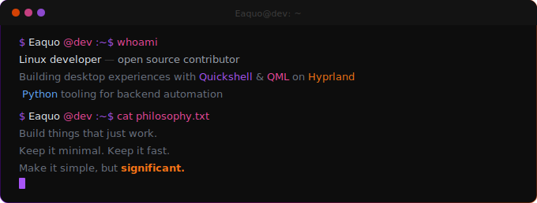
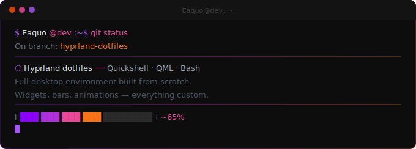

  

 

  

    

  

 

---

 

  

 

---

 

## 🎮 Featured project

  

Steam Deck-style game launcher for Hyprland · Available on the AUR

 

---

 

## Currently building

  

 

---

 

## Stack

<table border="0" cellspacing="0" cellpadding="10">
  <tr>
    <td align="center"></td>
    <td align="center"></td>
    <td align="center"></td>
    <td align="center"></td>
    <td align="center"></td>
    <td align="center"></td>
  </tr>
  <tr>
    <td align="center">Linux</td>
    <td align="center">Bash</td>
    <td align="center">Python</td>
    <td align="center">QML</td>
    <td align="center">Git</td>
    <td align="center">Neovim</td>
  </tr>
</table>

 

---

 

## Stats

  
  

 

  

 

---

 

  
    
  <code>$ Eaquo@dev:~$ echo "Code · Create · Improve · Repeat"</code>

